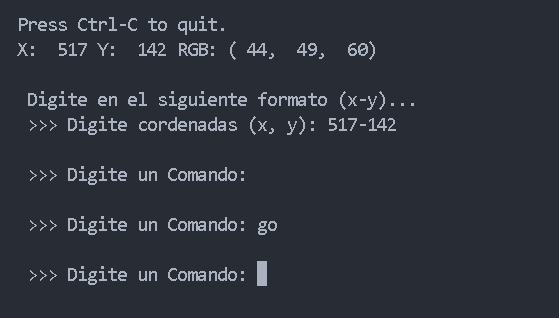
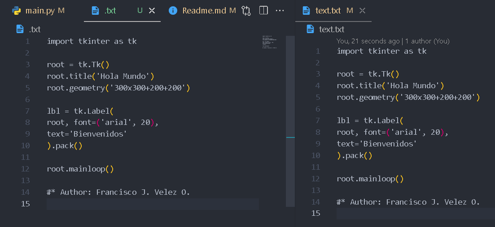

# Script-Python-AutomaticWriting

Project #4 with Python. Code to write automatically.

## To use the code

> Install the "pyautogui" library

When starting the program, it shows you the coordinates of the
cursor brings the console to the foreground and move the cursor to where
want to write after this press the keys (Ctrl + C) and type
the coordinates, then it asks you for a command to execute by default
you have two options:
1. Digit "1"
2. Type "go"

After this, type any of these options or modify
the file place for your own options, the mouse will move to
the indicated coordinates and click and then begin to write,
if you typed "1" it will write "Hello World!", on the contrary if
you typed "go" it will write everything in the file itself
program directory called "text.txt"

## Images of the graphical interface

**Image 1**

**Image 2**

<i>Best respect !!! </i>

**<cite>Author: Francisco Velez</cite>**
